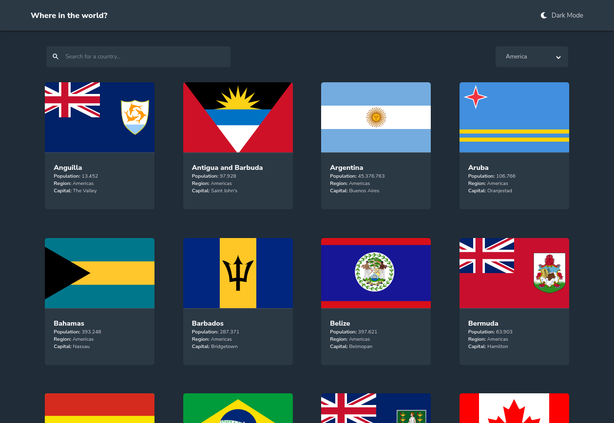
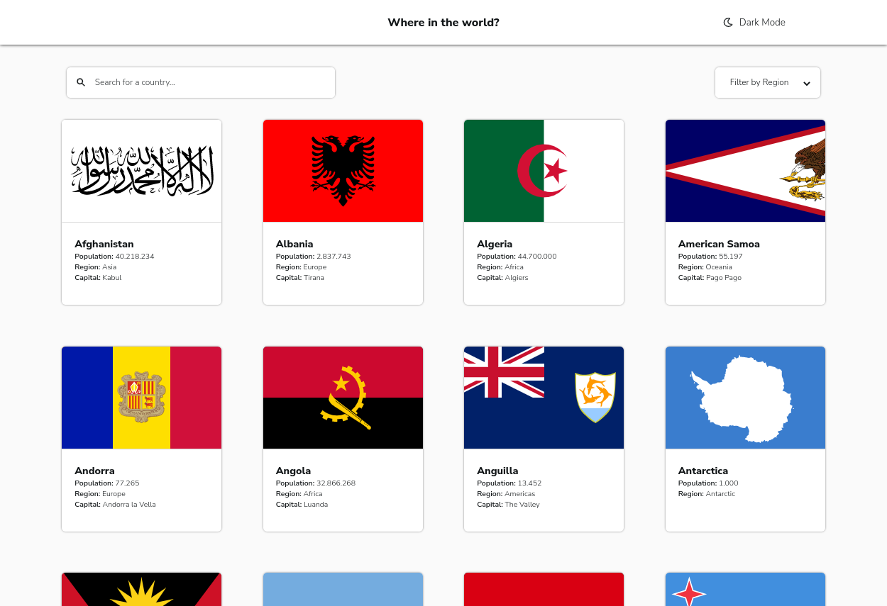
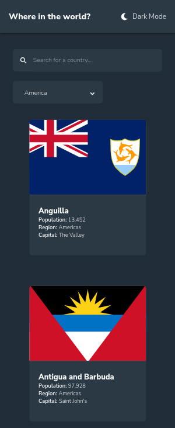
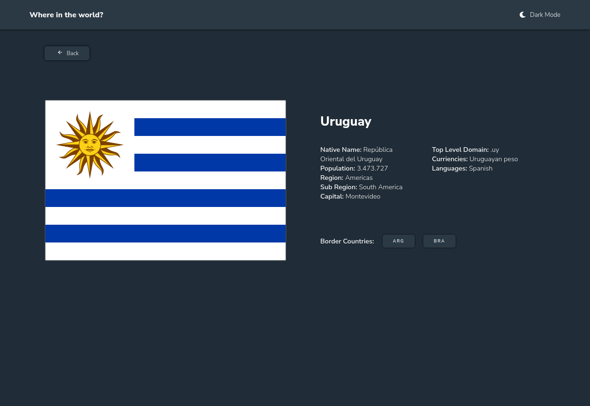
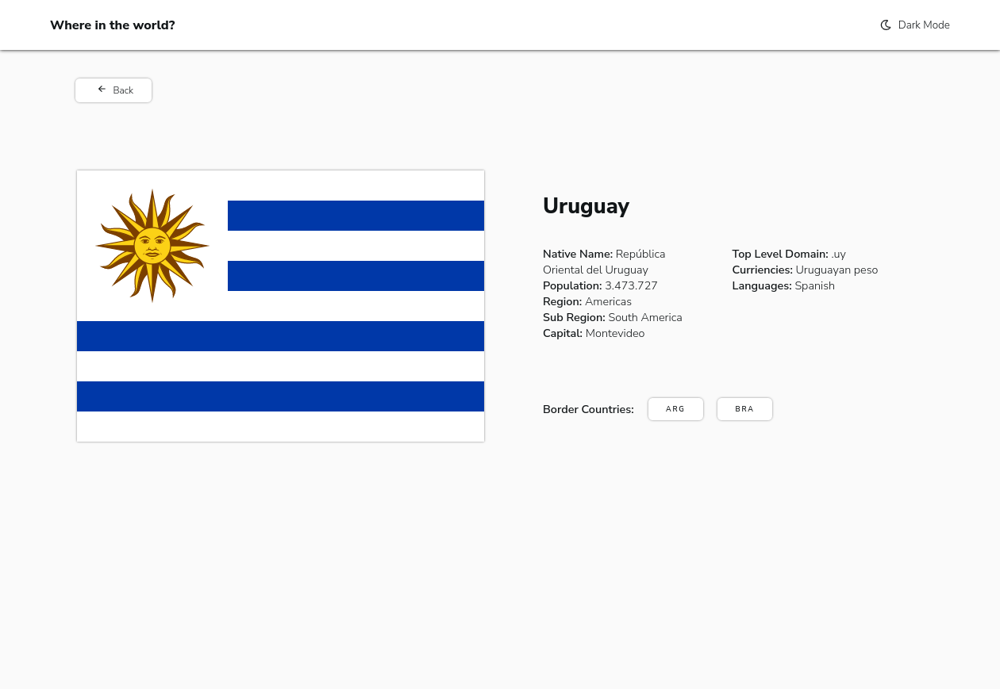
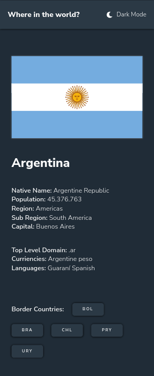

# Frontend Mentor - REST Countries API with color theme switcher solution

This is a solution to the [REST Countries API with color theme switcher challenge on Frontend Mentor](https://www.frontendmentor.io/challenges/rest-countries-api-with-color-theme-switcher-5cacc469fec04111f7b848ca). Frontend Mentor challenges help you improve your coding skills by building realistic projects. 

## Overview

### The challenge

Users should be able to:

- See all countries from the API on the homepage
- Search for a country using an `input` field
- Filter countries by region
- Click on a country to see more detailed information on a separate page
- Click through to the border countries on the detail page
- Toggle the color scheme between light and dark mode

### Screenshot

### Links

- Solution URL: [Add solution URL here](https://your-solution-url.com)
- Live Site URL: [Rest-Countries](https://rest-countries-lamc305.vercel.app/)

## My process

### Built with

- Semantic HTML5 markup
- CSS custom properties
- Flexbox
- CSS Grid
- Mobile-first workflow
- [React](https://reactjs.org/) - JS library
- [React-Router-Dom](https://reactrouter.com/en/main)
- [React-Icons](https://react-icons.github.io/react-icons/)

### Useful resources

- [Goncy Challenge](https://www.youtube.com/watch?v=B7Ia6OD6wJ4) - This helped me for apply filter in the page. I really liked this pattern and will use it going forward.

## Author

- Website - [LinkedIn](https://www.linkedin.com/in/luis-medina-dev/)
- Frontend Mentor - [@lamc305](https://www.frontendmentor.io/profile/lamc305)
